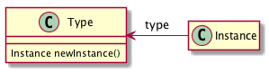
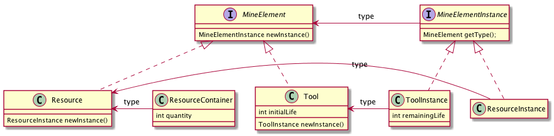
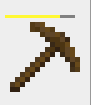
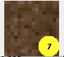
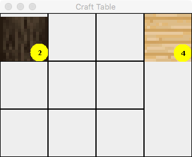

# Flatcraft 2019

Pour lancer l'application :
- ./build.sh
- java -jar flatcraft.jar

## Notre fonctionnalité

Notre fonctionnalité consiste à créer un Ender Chest. Cet objet est un
coffre pouvant être placé plusieurs fois et possède le même contenu pour
chaque coffre. 

Exemple : Si on place un objet dans ce coffre, tous les Ender Chest
possèdent cet objet. Si on retire un objet, cet objet est retiré pour
tous les Ender Chest.

Nous avons également ajouté :
- Le diamant, pioche en diamant, de l'obsidienne
- Des coffres basiques 
- La possibilité de sélectionner la quantité de ressource à placer dans un coffre
- Des biomes (sable, neige, plaines)
- Changement de textures du jeu 
- Agrandissement de la map et vue qui s'adapte en fonction de la hauteur

> Le but du projet flatcraft est de servir de base pour le développement d'une 
> nouvelle fonctionnalité pour un binôme (éventuellement trinôme) d'étudiants.

## Semaine 5 : découverte du code du jeu

Le but de la semaine 5 est que de découvrir le code du projet.
Vous devez pour cela réaliser un certain nombre de modifications dans 
le code original

Il y a actuellement [2435 lignes de code sans bug ou vulnérabilité détectés par SonarQube](https://forge.univ-artois.fr/sonar67/dashboard?id=flatcraft_dut2017).


### Partie 1 : préparation de l'environnement

Comme pour le projet constructeur, vous devez "forker" le projet. 
Cependant, cette fois-ci, vous travaillez en binôme.
**Seul un membre du binôme doit faire un fork du projet.**

Ensuite, vous devez rajouter le deuxième membre du binôme dans le projet comme `developer`.

Vous devez aussi rajouter l'enseignant de TP comme `reporter`.

Chaque membre du binôme fait un `git clone` sur sa machine.

Chaque membre du binôme intègre le projet dans son EDI préféré : comme il s'agit d'un projet Eclipse, 
il peut être facilement intégré en faisant `Import .../Import existing projet into workspace`.

### Partie 2 : de l'intérêt du patron de conception décorateur

Il existe deux implémentations du patron de conception décorateur, pour générer la carte de jeu.

Le code ci-dessous se trouve dans la classe `Main`.

```
MapGenerator generator = new TerrilDecorator(new TreeDecorator(new SimpleGenerator(), 10, 5), 5);
```

Que se passe t'il si vous inversez les deux décorateurs ?

```
MapGenerator generator = new TreeDecorator(new TerrilDecorator(new SimpleGenerator(), 5), 10, 5);
```

Comment faire pour avoir 3 terrils sur la carte ?

### Partie 3 : modification du code existant

Le but est maintenant de modifier de manière dirigée le code actuel du jeu 
pour vous en faire découvrir les mécanismes.

Les classes importantes pour réaliser ces modifications sont :

- [MineUtils](src/dut/flatcraft/MineUtils.java)
- [Resource](src/dut/flatcraft/resources/Resource.java)
- [ResourceInstance](src/dut/flatcraft/resources/ResourceInstance.java)
- [ExecutableResource](src/dut/flatcraft/resources/ExecutableResource.java)
- [ExecutableResourceInstance](src/dut/flatcraft/resources/ExecutableResourceInstance.java)
- [ResourceCellFactory](src/dut/flatcraft/ResourceCellFactory.java)

ainsi que les fichiers [`craftrules.txt`](src/craftrules.txt) et [`furnacerules.txt`](src/furnacerules.txt) à la racine du répertoire `src`.

1. Ajouter une nouvelle ressource de votre choix
1. Ajouter un nouvel outil de votre choix
1. Ajouter une nouvelle règle à la table de craft ou au fourneau
1. Ajouter une nouvelle action quand on clique sur une ressource particulière

De nombreuses images sont disponibles dans le répertoire `textures`. 
Les noms des fichiers sont normalisés, `default_xxxxx.png` ce qui permet de facilement intégrer 
ces images dans votre programme en utilisant un nom court (ici `xxxxx`).

Par exemple, pour récupérer l'image correspondant au fichier `textures/default_acacia_tree.png`,
il suffit d'utiliser la méthode `MineUtils.getImage("acacia_tree")`.

### Partie 4 : à vous de jouer
 
Chaque binôme doit décider d'une nouvelle fonctionnalité à ajouter au jeu flatcraft.
Idéalement, le travail des différents groupes pourra être aggrégé pour obtenir 
un jeu plus complet.

Vous devez déposer votre proposition de fonctionnalité sur Moodle.

# Flatcraft (sujet 2017)

Flatcraft est une version simplifiée 2D de MineCraft qui doit être réalisée en binôme par les étudiants de DUT2 en informatique de Lens.

On utilisera par défaut les images disponibles dans la version libre de MineCraft, [Minetest](http://minetest.net/).
Il est possible d'utiliser d'autres images, *si leur licence le
permet* (par exemple, creative commons).

Le but de ce projet logiciel est de mettre en pratique les patrons de
conception vus durant la seconde année de DUT et de réaliser une
application complète en Java/Swing. Il s'agit aussi de s'habituer à
utiliser un outil de gestion de version comme git, et d'un outil de
gestion de projet comme gitlab.

Différents exercices vont permettre de construire graduellement
l'application : 

- la création d'un espace de jeu (une grille contenant des images)
- la réaction à des évènements (patron de conception observateur/écouteur)
- la mise en place du glissé/déplacé en swing

Certaines fonctionnalités et règles sont obligatoires, et doivent se retrouver dans les projets de chaque groupe.

D'autres sont laissées à l'appréciation de chaque groupe.

Même si le jeu se déroule en 2D, l'idée est d'essayer de réaliser une application avec laquelle on a envie de jouer.

C'est pourquoi chaque groupe a la possibilité d'utiliser ses propres
règles du jeu, du moment que l'esprit du monde de brique est préservé.

## Mise en place de la base du jeu

La première étape est de créer l'environnement du jeu : la création des mondes à explorer, et la mise à disposition des ressources et des outils.

### Le monde des ressources

Nous allons considérer un monde en 2D, représenté sur un plan : nous disposons d'une grille de blocs, et chaque bloc peut être "détruit, reposé ou transformé". 

On peut imaginer de nombreuses façons de créer un monde flatcraft. Au
minimum, le jeu proposera une génération aléatoire du monde.

On utilisera les règles suivantes pour créer un monde flatcraft
aléatoirement :

- au niveau 0, on trouvera de l'herbe, de l'eau, du bois, de la neige ou du sable
- aux niveaux 1 à 5, on trouvera entre 1 et 5 blocks de boue
- aux niveaux suivants, on trouvera de la pierre, avec dans certains cas du charbon, de l'or, du minerai de fer : plus la profondeur est importante, plus la probabilité de trouver de l'or et du fer doit être importante.
- au niveau k, un bloc de lave indiquera que l'on ne peut pas creuser plus loin.

Chaque ressource sera représentée par un `JButton` particulier, ce qui permettra de facilement récupérer un clic de souris grâce à un écouteur de type `ActionListener`.
On utilisera un clic de souris pour creuser/consommer une ressource et la touche "CTRL" avec un clic de souris pour poser une ressource.

Le code suivant permet de reconnaître cette combinaison de touches :

```java
public void actionPerformed(ActionEvent ae) {
        ...
		if ((ae.getModifiers() & ActionEvent.CTRL_MASK) == ActionEvent.CTRL_MASK) {
		    // déposer
		} else {
		    // creuser
		}
	}
```
	
**Bonus :  proposer une génération de monde plus réaliste.****

1. générer le monde de telle sorte que sur la surface, la neige, l'eau et le sable ne soient pas des blocks uniques disposés aléatoirement sur la carte.
2. générer le monde de telle sorte que sous la surface, on trouve des "veines" de charbon, d'or ou de minerai de fer
3. générer des motifs à la surface ou à une profondeur donnée.

## Représentation des ressources : le patron de conception TypeObject

Il existe un problème particulier pour représenter des ressources sur notre jeu : en effet, chaque "Type" d'élément (herbe, bois, pierre, or) a ses propres caractéristiques (dureté, forme une fois extrait, etc). Une carte est constituée de nombreuses "instances" de ce "type" : quand on trouve plusieurs fois un morceau de bois sur notre carte, le type du bloc est bien du bois, mais il s'agit d'un bloc particulier, qui a ses propres caractéristiques (par exemple combien de fois il a été creusé par l'outil). Une solution naïve serait de créer une seule classe avec toutes ces informations. Cependant, cela provoquerait des duplications d'information : tous les objets représentant un morceau de bois vont devoir connaître l'image représentant un morceau de bois par exemple.

Il existe un patron de conception pour résoudre ce problème : [TypeObject](http://www.cs.ox.ac.uk/jeremy.gibbons/dpa/typeobject.pdf).



Son principe est le suivant : la classe `Type` représente les informations partagées et la classe `Instance` représente les informations spécifiques à l'instance. Une relation unidirectionnelle de `Instance` vers `Type` permet à un objet `Instance` d'avoir accès aux informations communes. De plus, une fabrique dans la classe `Type` contrôle la création des objets de type `Instance`. 

Dans le cas du jeu flatcraft, nous disposons de deux types d'éléments spécifiques : les outils et les ressources. Il faut appliquer le patron de conception à chaque type d'éléments. On obtient par exemple le diagramme de classes suivant :



## Caractéristiques des ressources et des outils

Chaque groupe est libre d'utiliser le mode de gestion des ressources et des outils qui lui convient pour ce jeu.

Il faudra cependant veiller à ce que :

- toutes les ressources ne peuvent pas être creusées (par exemple, la lave)
- toutes les ressources ne peuvent pas être creusées par tous les outils (par exemple, il faut une pioche pour creuser la pierre)
- les outils s'usent, ils ont une durée de vie limitée.

Vous devez disposer d'au moins 3 outils différents dans votre jeu.

### Des boutons spécifiques pour représenter les outils et les conteneurs de ressources

#### Les outils


Les outils ont généralement une durée de vie, qui sera spécifique à chaque type outil. Il est nécessaire de pouvoir visualiser cette durée de vie sur l'outil. Cela se fait généralement par une "barre de vie". Il suffit de redéfinir la méthode `paintComponent` du composant graphique (un `JButton` par exemple) pour rajouter une barre de vie. Le code suivant affiche une barre de vie jaune comme dans l'exemple ci-dessous :



```java
@Override
	protected void paintComponent(Graphics g) {
		if (tool.getCurrentLife() > 0) {
			super.paintComponent(g);
			Rectangle rect = g.getClipBounds();
			g.setColor(Color.GRAY);
			g.fillRect(rect.x+5, rect.y+70, 70, 3);
			g.setColor(Color.YELLOW);
			g.fillRect(rect.x+5, rect.y+70, (int)(tool.getCurrentLife()*70.0)/tool.getType().getInitialLife(), 3);
		}
	}
```

#### Les conteneurs de ressources

Dans l'inventaire, les ressources sont stockées dans des "conteneurs". Ces conteneurs ont vocation à recevoir des ressources quand on creuse le terrain et à fournir et récupérer des ressources lors de la phase de transformation. Il existe plusieurs façons de réaliser ces conteneurs.
On supposera simplement que l'on dispose du nombre de ressources disponibles. Le code suivant affiche une pastille jaune indiquant la quantité de ressources (limitée à 2 chiffres, soit 99) comme dans l'exemple ci-dessous :



```java
@Override
	protected void paintComponent(Graphics g) {
		int qty = container.getQuantity();
		if (qty > 0) {
			super.paintComponent(g);
			Rectangle rect = g.getClipBounds();
			g.setColor(Color.YELLOW);
			g.fillOval(rect.x + rect.width - 30, rect.y + rect.height - 30, 30, 30);
			g.setColor(Color.BLACK);
			g.setFont(g.getFont().deriveFont(Font.BOLD, g.getFont().getSize()));
			if (qty < 10) {
				g.drawString(String.valueOf(qty), rect.x + rect.width - 17, rect.y + rect.height - 10);
			} else {
				g.drawString(String.valueOf(qty), rect.x + rect.width - 21, rect.y + rect.height - 10);
			}
		}
	}
```

## Création de ressources : la table de craft

### Principe

Creuser le monde permet de trouver des ressources naturelles. Il est nécessaire de manufacturer ces produits pour confectionner de nouvelles ressources ou des outils.

La table de craft est une grille 3x3 qui permet de créer des ressources à l'aide de motifs. Voir sur [la page dédiée de MineTest](http://wiki.minetest.com/wiki/Crafting) pour des exemples de motifs. Chaque groupe a le droit de s'inspirer des motifs originaux (cela améliore la jouabilité du jeu) mais peut aussi en inventer des nouveaux (mais il faut les documenter).

On notera simplement que :

- la grille ne peut recevoir que des ressources (pas des outils)
- la table de craft peut fournir soit un outil, soit une certaine quantité de ressources.

### Réalisation

D'un point de vue graphique, la table de craft peut être réalisée à l'aide d'un `JPanel` utilisant un `BorderLayout`. Au centre, on place la grille de craft (un autre `JPanel` avec un `GridLayout` 3x3) et à l'est on place le produit manufacturé. Voici un exemple de réalisation avec ces composants graphiques.



La réalisation de la table de craft est essentiellement basée sur la gestion du glissé/déplacé. Il faudra être attentif aux règles suivantes pour utiliser au mieux cette fonctionnalité de Java/Swing.

1. On utilisera comme pour la semaine 3 de `JPanel` comme receptacles de composants graphiques : ils seront associés à des `TransferHandler` de type "To".
1. On utilisera des composants graphiques (`JLabel`, `JButton`, `JToggleButton`) comme source du glissé/déplacé : ils seront associés à des `TransferHandler` de type "From" et à un écouteur de type `MouseListener` pour reconnaître l'action de glissé/déplacé.
1. On utilisera soit des actions de type `MOVE`(toutes les ressources sont déplacées) soit des actions de type `COPY` (la moitié des ressources sont déplacées). On affectera par exemple un bouton particulier de la souris pour gérer chacune des actions.

Pour permettre de filtrer les objets graphiques selon leur type, et n'accepter que des ressources dans la grille de craft, on définira des "saveurs" particulières pour les ressources et les outils. Ces saveurs seront utilisées dans les objets `TransfertHandler` pour définir le type des objets transportés. 

```java
public static final DataFlavor RESOURCE_FLAVOR = new DataFlavor(ResourceContainer.class, "resourcecontainer");
public static final DataFlavor TOOL_FLAVOR = new DataFlavor(Tool.class,"tool");
```

**Par défaut, avec ces contraintes, il ne sera pas possible de déposer une nouvelle ressource sur une ressource existante dans la table de craft, car le transfer handler est sur un `JPanel`, pas sur l'objet graphique représentant la ressource. Il faudra donc vider la cellule avant de la réutiliser. Cela peut se faire de deux façons : par glissé/déplacé ou quand la quantité de ressources devient nulle.**

Chaque groupe est libre de gérer son inventaire comme il le souhaite :

- accès à un sac avec un nombre d'éléments limité (généralement 9) et gestion du transfert entre le sac et un inventaire complet.
- accès à un inventaire unique, sans limite
- mélange des outils et des ressources dans l'inventaire

### Bonus : le four

Il est généralement nécessaire d'avoir un four pour créer des
ressources à partir d'un minerai : du fer ou de l'or par exemple.

Le principe du four n'est pas très différent de celui de la table de
craft : on dispose d'un minerai, et d'un combustible pour obtenir une
nouvelle ressource.

Les groupes avancés dans la réalisation du projet qui souhaitent
aller plus loin peuvent introduire le concept de four dans le jeu.

Comme pour la table de craft, on considèrera que le four est toujours
disponible dans l'environnement du jeu.

## Analyse automatique du code produit, finitions

Le code Java écrit lors de ce projet sera analysé automatiquement à
partir de la semaine 6  à l'aide de l'outil
[SonarQube](http://www.sonarqube.org/).

### Mise à jour du projet du groupe avec les données partagées

Pour mettre à jour votre copie du projet `flatcraft` avec ces
nouvelles instructions, vous devez effectuer ces commandes une
première fois dans votre copie locale du projet :

```
git remote add upstream https://forge.univ-artois.fr/dut2017/flatcraft.git
git pull upstream master
```

Ensuite, il suffira de taper la commande `git pull upstream master`
pour mettre à jour votre projet avec les données partagées.


## Résultat attendu (pour information, c'était en 2017)

*On doit pouvoir jouer à votre jeu. Un projet qui ne compile pas ou qui
ne s'exécute pas se verra attribué la note arbitraire de 1/20 pour le binôme.*

Une note de fonctionnalité sera établie selon les critères suivants :

- [ ] Il est possible de creuser le monde pour découvrir de nouvelles ressources
- [ ] Il est possible d'utiliser plusieurs outils pour creuser (au moins 3)
- [ ] Il est possible de transformer des ressources pour créer de nouvelles ressources ou outils (table de craft)
- [ ] Il est possible de déposer des ressources sur le monde
- [ ] Les ressources sont disposées correctement dans le monde
- [ ] Le temps nécessaires à l'obtention d'une ressource dépend des ressources et des outils utilisés
- [ ] Aucun bug visible n'apparait lors d'un test rapide de l'application
- [ ] Le fonctionnement de l'application est intuitif (on ne reste jamais bloqué)
- [ ] La gestion des ressources et des outils est avancée

Une note de conception orientée objet sera établie selon les critères suivants :

- [ ] Le principe d'encapsulation est respecté dans toutes les classes
- [ ] La délégation et l'héritage sont utilisés correctement
- [ ] Le polymorphisme est préféré aux structures conditionnelles.
- [ ] Plusieurs patrons de conception sont utilisés (au moins 3 différents)
- [ ] Un diagramme de classe résumant la conception du programme est disponible

Une note de travail collaboratif  sera établie selon les critères suivants :

- [ ] Le dépôt git contient au moins 15 commits, répartis sur les 5 semaines de travail.
- [ ] Les deux membres du binôme sont auteurs de ces commits.
- [ ] Au moins un ticket a été créé et fermé lors du développement.

Une note de présentation complètera cela :

- [ ] Présence d'un texte résumant le fonctionnement spécifique du jeu
- [ ] Code source correctement indenté
- [ ] Passe le niveau d'exigence DUT2 sur l'instance locale de SonarQube.
